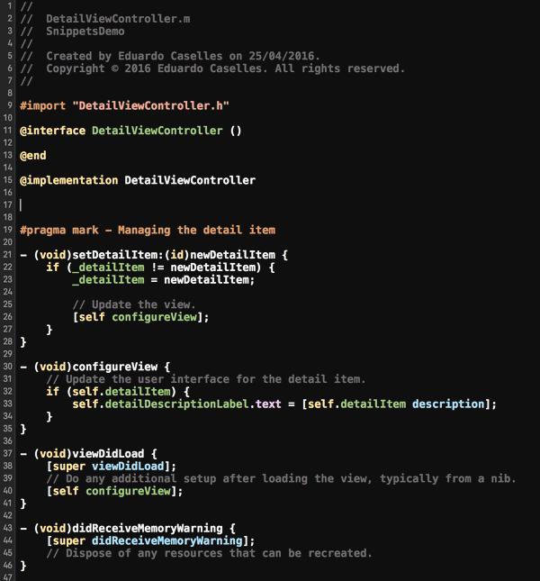

# ECXcodeSnippets
This is just a convenient collection of Objective-C code snippets for Xcode.

# Installation

Code snippets in Xcode live under the `~/Library/Developer/Xcode/UserData/CodeSnippets`. In order to use these snippets, you just need to do the following:

1. Copy snippets to `~/Library/Developer/Xcode/UserData/CodeSnippets` (create the folder if it does not exits).
2. Restart Xcode.

# Usage

In Xcode's code editor, start typing the snippet's completion shortcut and wait for auto-completion to do its magic.

